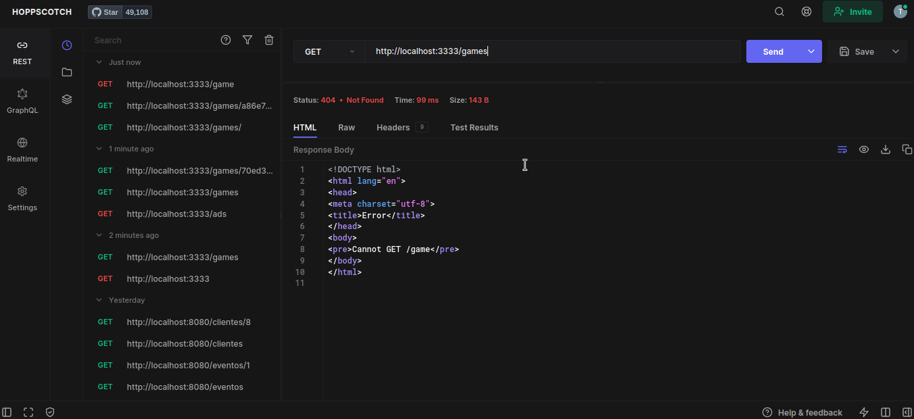
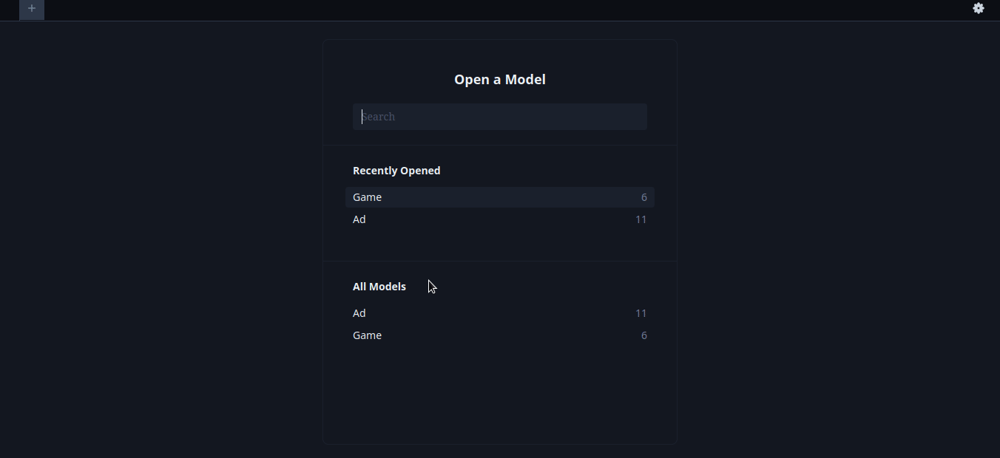

<!-- Improved compatibility of back to top link: See: https://github.com/othneildrew/Best-README-Template/pull/73 -->
<a name="readme-top"></a>

<!-- PROJECT SHIELDS -->
[![Stargazers][stars-shield]][stars-url]
[![Issues][issues-shield]][issues-url]
[![MIT License][license-shield]][license-url]

<!-- PROJECT LOGO -->
<br />
<div align="center">


<H3 align="center">Esports</h3>

  <p align="center">
  The eSports API
    <br />
    <a href="https://moveit-iota-seven.vercel.app/">View deploy</a>
    ·
    <a href="https://github.com/taleshrocha/eSports-front/issues">Report Bug</a>
    ·
    <a href="https://github.com/taleshrocha/eSports-front/issues">Request Feature</a>
  </p>
</div>

<!-- TABLE OF CONTENTS -->
<details>
  <summary>Table of Contents</summary>
  <ol>
    <li>
      <a href="#about-the-project">About The Project</a>
      <ul>
        <li><a href="#built-with">Built With</a></li>
      </ul>
    </li>
    <li>
      <a href="#getting-started">Getting Started</a>
      <ul>
        <li><a href="#installation">Installation</a></li>
      </ul>
    </li>
    <li><a href="#usage">Usage</a></li>
    <li><a href="#database">Database</a></li>
    <li><a href="#license">License</a></li>
    <li><a href="#acknowledgments">Acknowledgments</a></li>
  </ol>
</details>

<!-- ABOUT THE PROJECT -->
## About The Project

![Product Name Screen Shot][product-screenshot]

This is the API os the eSports application. The front-end is in here: <a href="https://github.com/taleshrocha/eSports-front">eSports-front</a>.

<p align="right">(<a href="#readme-top">back to top</a>)</p>

### Built With

* [![Next][Next.js]][Next-url]
* [![React][React.js]][React-url]
* [![Prisma][Prisma-logo]][Prisma-url]

<p align="right">(<a href="#readme-top">back to top</a>)</p>

<!-- GETTING STARTED -->
## Getting Started

To get a local copy up and running follow these simple example steps.

### Installation

1. Clone the repo
   ```sh
   git clone https://github.com/taleshrocha/eSports-front.git
   ```
2. Install npm packages
   ```sh
   npm install
   ```

<p align="right">(<a href="#readme-top">back to top</a>)</p>

<!-- USAGE EXAMPLES -->
## Usage

Run the application in localhost with
   ```sh
   npm run dev
   ```
   
Here, using <a href="https://hoppscotch.io/">Hoppscotch</a>:



<p align="right">(<a href="#readme-top">back to top</a>)</p>

<!-- DATABASE -->

It was used SQLite database. Here is it using <a href="https://www.prisma.io/">Prisma Studio</a>.



<!-- LICENSE -->
## License

Distributed under the MIT License. See `LICENSE` for more information.

<p align="right">(<a href="#readme-top">back to top</a>)</p>

<!-- ACKNOWLEDGMENTS -->
## Acknowledgments

This project was possible by [Rocketseat](https://www.rocketseat.com.br/) Next Level Week 5.

<div align="center">
<a href="https://github.com/taleshrocha">
 
 <br />
 <sub><b>Tales Rocha</b></sub></a>

Done with ❤️ by  Tales Rocha 👋🏽 Contact me!

<p align="right">(<a href="#readme-top">back to top</a>)</p>

<!-- REFERENCES -->
[product-screenshot]: ./images/front-screen.png

[contributors-shield]: https://img.shields.io/github/contributors/taleshrocha/move-it.svg?style=for-the-badge
[contributors-url]: https://github.com/taleshrocha/move-it/graphs/contributors
[forks-shield]: https://img.shields.io/github/forks/taleshrocha/move-it.svg?style=for-the-badge
[forks-url]: https://github.com/taleshrocha/move-it/network/members
[stars-shield]: https://img.shields.io/github/stars/taleshrocha/move-it.svg?style=for-the-badge
[stars-url]: https://github.com/taleshrocha/move-it/stargazers
[issues-shield]: https://img.shields.io/github/issues/taleshrocha/move-it.svg?style=for-the-badge
[issues-url]: https://github.com/taleshrocha/move-it/issues
[license-shield]: https://img.shields.io/github/license/taleshrocha/move-it.svg?style=for-the-badge
[license-url]: https://github.com/taleshrocha/move-it/blob/master/LICENSE.txt

[linkedin-shield]: https://img.shields.io/badge/-LinkedIn-black.svg?style=for-the-badge&logo=linkedin&colorB=555
[linkedin-url]: https://linkedin.com/in/linkedin_username

[Next.js]: https://img.shields.io/badge/next.js-000000?style=for-the-badge&logo=nextdotjs&logoColor=white
[Next-url]: https://nextjs.org/
[React.js]: https://img.shields.io/badge/React-20232A?style=for-the-badge&logo=react&logoColor=61DAFB
[Prisma-logo]: https://img.shields.io/badge/Prisma-20232A?style=for-the-badge&logo=prisma&logoColor=61DAFB
[Prisma-url]: https://www.prisma.io/
[React-url]: https://reactjs.org/
